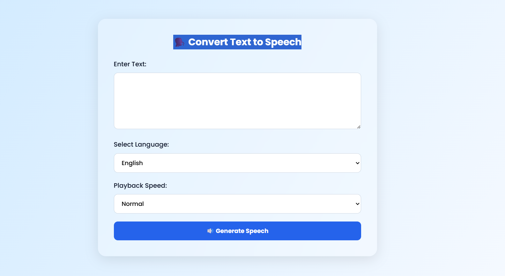

# 🗣️ Flask Text-to-Speech Web App

A modern, multilingual text-to-speech web app built with Flask and Google Text-to-Speech (`gTTS`).

🎯 **Features**
- Convert any text into human speech
- Supports major Asian languages (Hindi, Japanese, Chinese, Korean, Tamil, etc.)
- Playback speed: Normal or Slow
- Audio playback and download in browser
- Clean, minimal, responsive UI (Glassmorphism + Poppins)

---

## 🌍 Live Demo

Coming Soon – deploying to Render or PythonAnywhere...

---

## 🚀 Screenshots

!

## 📦 Installation

```bash
git clone https://github.com/Saket2002/flask_Text_to_Speech.git
cd flask_Text_to_Speech
pip install -r requirements.txt
python app.py
